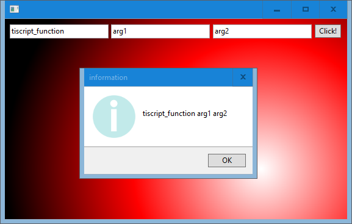

# sciter-tiscript-from-rust

## Call TIScript function from Rust

## Description

When you click the button, TIScript will execute a Rust function.  

This Rust function will then call another TIScript function.

